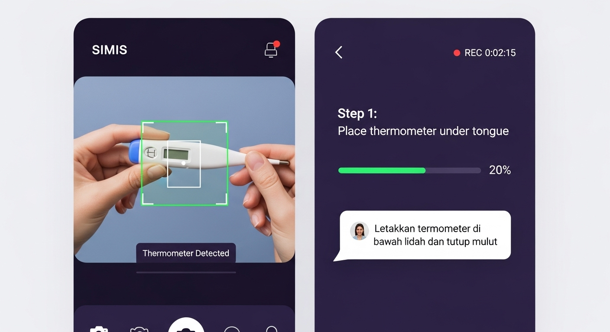

# SIMIS AI - Medical Device Guidance System

A multilingual, AI-powered medical device guidance application that provides real-time assistance for using medical devices. The system combines computer vision, text-to-speech, and conversational AI to guide users through device operation procedures in multiple Southeast Asian languages.



## 🌟 Features

### Core Functionality
- **Smart Device Detection**: AI-powered computer vision recognizes medical devices using your camera
- **Multilingual Support**: Available in 10+ Southeast Asian languages with native voice support
- **Real-time AI Guidance**: Dynamic step-by-step instructions powered by OpenAI GPT-4o
- **Interactive Chat**: Conversational AI assistant with formatted responses and multi-language support
- **Voice Options**: Enhanced TTS with male, female, or text-only guidance across multiple languages
- **Personalized Experience**: Three distinct AI guidance styles (direct, gentle, detailed) with dramatically different outputs

### Navigation & Control
- **Step Navigation Controls**: Previous, Next, Skip, and Complete buttons for easy progression
- **Smart Progress Tracking**: Visual step indicators showing "Step X of Y" with completion status
- **Session Management**: Full session lifecycle with backward/forward navigation capabilities
- **Visual Progress Bar**: Real-time progress visualization in the sidebar

### Enhanced User Experience  
- **Formatted Chat Responses**: Numbered lists, bullet points, and bold text formatting
- **Audio-Visual Sync**: Identical audio and visual instructions for consistency
- **Responsive Design**: Mobile-friendly interface with purple gradient theme
- **Error Handling**: Comprehensive error states and fallback mechanisms

## 🚀 Quick Start

### Prerequisites

- Node.js 18+ 
- npm or yarn package manager

### Installation

1. Clone the repository:
   ```bash
   git clone https://github.com/yourusername/simis-ai.git
   cd simis-ai
   ```

2. Install dependencies:
   ```bash
   npm install
   ```

3. Start the development server:
   ```bash
   npm run dev
   ```

4. Open your browser and navigate to `http://localhost:5000`

## 🏗️ Architecture

### Frontend Architecture
- **Framework**: React with TypeScript, built using Vite for fast development
- **UI Components**: shadcn/ui component library built on Radix UI primitives with Tailwind CSS
- **State Management**: Zustand for global state management
- **Routing**: Wouter for lightweight client-side routing
- **Data Fetching**: TanStack Query for server state management

### Backend Architecture
- **Server Framework**: Express.js with TypeScript running on Node.js
- **Development Setup**: Vite middleware integration for seamless development
- **API Design**: RESTful endpoints for guidance session management
- **Data Storage**: In-memory storage with abstract interface for future database integration
- **Session Management**: Stateless session handling with unique session identifiers

### Key Technologies
- **AI Integration**: OpenAI SDK for GPT-4o model with real-time instruction generation
- **Enhanced TTS System**: Web Speech API with improved male/female voice detection
- **Computer Vision**: Simulated device detection system with realistic confidence scores
- **Step Navigation**: Full session control with previous/next/skip/complete functionality
- **Formatted Chat**: Rich text rendering with numbered lists, bullets, and bold formatting
- **Database**: Drizzle ORM with PostgreSQL support (configured for @neondatabase/serverless)
- **Styling**: Tailwind CSS with custom purple gradient design system

## 🎯 Current Implementation Status

### Fully Implemented Features ✅
- **Multi-Device Support**: Oral thermometer, blood pressure monitor, and blood glucose meter
- **AI Guidance Styles**: Direct, Gentle, and Detailed modes with distinct AI personalities
- **Step Navigation**: Complete navigation system with Previous/Next/Skip/Complete controls
- **Enhanced TTS**: Working male and female voice selection across languages
- **Formatted Chat**: Rich text responses with lists, formatting, and proper spacing
- **Progress Tracking**: Visual step indicators and completion tracking
- **Multilingual Support**: 10+ Southeast Asian languages with native TTS

### Technical Achievements ✅
- **Real-time AI Generation**: Dynamic instruction creation using OpenAI GPT-4o
- **Audio-Visual Consistency**: Synchronized audio and visual instructions
- **Session Management**: Full backward/forward navigation with state persistence
- **Enhanced Voice System**: Fixed TTS to properly detect and use male/female voices
- **Rich Text Rendering**: Chat responses with numbered lists, bullet points, and bold formatting
- **Smart Navigation Logic**: Context-aware button states (Previous, Next, Complete, New Session)
- **Error Handling**: Comprehensive fallback systems and user feedback
- **Responsive Design**: Mobile-optimized interface with accessibility features

### Recent Development Highlights 🚀
- **Step Navigation System**: Complete implementation of Previous/Next/Skip/Complete controls
- **TTS Voice Selection Fix**: Resolved male voice limitation - now properly detects "Microsoft George", "Google UK English Male", etc.
- **AI Response Formatting**: Enhanced system prompts to generate well-structured responses with proper formatting
- **Chat Interface Overhaul**: Rebuilt chat system with backend API integration and rich text support
- **Progress Visualization**: Added visual step indicators showing "Step X of Y" with completion status
- **Audio-Visual Sync**: Fixed instruction consistency between spoken and displayed text

## 📱 How It Works

### Getting Started
1. **Select Your Device**: Choose from thermometer, blood pressure monitor, or glucose meter
2. **Choose Language & Style**: Pick from 10+ Southeast Asian languages and 3 guidance styles
3. **Set Voice Preference**: Select male voice, female voice, or text-only mode
4. **Start Guided Session**: Follow AI-generated instructions with camera detection

### During Your Session
- **Step-by-Step Navigation**: Use Previous/Next buttons to control your pace
- **AI-Powered Instructions**: Each step generates contextual guidance in your preferred style
- **Real-Time Chat Support**: Ask questions anytime with formatted AI responses  
- **Progress Tracking**: Visual indicators show your current step and overall progress
- **Camera Feedback**: Device detection provides real-time validation and corrections

### Advanced Features
- **Dynamic AI Generation**: Every instruction is generated in real-time by GPT-4o, not pre-written
- **Guidance Style Adaptation**: Direct (brief), Gentle (encouraging), Detailed (comprehensive) modes
- **Multi-Language TTS**: Enhanced voice selection with proper male/female voice detection
- **Session Persistence**: Continue sessions with full backward/forward navigation capability
- **Smart Error Recovery**: Corrective feedback when device detection issues occur

## 🛠️ Development

### Project Structure

```
├── client/                 # Frontend React application
│   ├── src/
│   │   ├── components/     # Reusable React components
│   │   ├── pages/         # Application pages
│   │   ├── store/         # Zustand state management
│   │   └── lib/           # Utility functions and services
├── server/                # Backend Express application
│   ├── routes.ts          # API route definitions
│   ├── storage.ts         # Data storage interface
│   └── index.ts           # Server entry point
├── shared/                # Shared types and schemas
│   └── schema.ts          # Zod schemas for type validation
└── attached_assets/       # Static assets and images
```

### Key Development Scripts

- `npm run dev` - Start development server with hot reload
- `npm run build` - Build production bundle
- `npm run preview` - Preview production build locally

### Data Schema Design
- **Type Safety**: Zod schemas for runtime validation of device types, languages, and session data
- **Session Management**: Comprehensive session tracking with step navigation and completion status
- **Device Instructions**: AI-generated contextual guidance rather than static content
- **Chat History**: Persistent conversation storage with formatted message rendering
- **Progress Tracking**: Step completion arrays and navigation state management

## 🌐 Deployment Considerations

- **Database Migration**: Drizzle-kit for database schema management and migrations
- **Environment Configuration**: Support for development and production environments
- **Static Asset Serving**: Express static file serving for production builds

## 🔧 External Dependencies

### Core Dependencies
- **AI Integration**: OpenAI SDK for natural language processing
- **Database**: Drizzle ORM with PostgreSQL support
- **Authentication**: Framework prepared for session-based authentication

### UI and Styling
- **Component Library**: Radix UI primitives for accessible components
- **Styling**: Tailwind CSS with custom design system
- **Icons**: Lucide React for consistent iconography

### Runtime Services
- **Media Access**: Browser MediaDevices API for camera access
- **Enhanced Speech Synthesis**: Web Speech API with improved male/female voice detection
- **AI Processing**: Real-time OpenAI GPT-4o integration for dynamic instruction generation
- **State Persistence**: Browser localStorage for user preferences and session data
- **Rich Text Rendering**: Custom formatting engine for numbered lists, bullets, and bold text

## 📄 License

This project is licensed under the MIT License.

## 🤝 Contributing

1. Fork the repository
2. Create your feature branch (`git checkout -b feature/amazing-feature`)
3. Commit your changes (`git commit -m 'Add some amazing feature'`)
4. Push to the branch (`git push origin feature/amazing-feature`)
5. Open a Pull Request

## 📞 Support

For support, please open an issue on GitHub or contact the development team.

---

Built with ❤️ for better healthcare accessibility