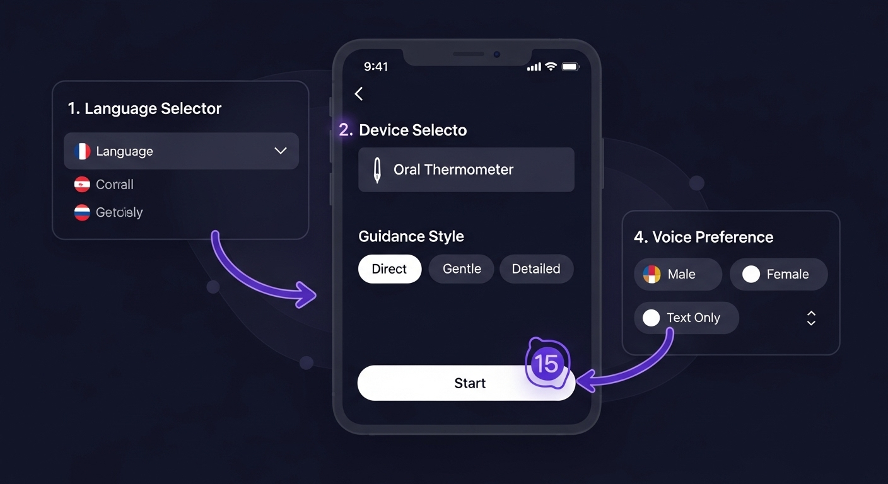

# SIMIS AI - User Guide

## How to Use the Medical Device Guidance System

### Getting Started

SIMIS AI is your intelligent medical device assistant that provides step-by-step guidance for using medical devices safely and effectively. Follow these simple steps:

## Step 1: Choose Your Language 🌐
- Click the **Language** button to see available options
- Select from 10 Southeast Asian languages:
  - 🇺🇸 English
  - 🇮🇩 Bahasa Indonesia  
  - 🇲🇾 Bahasa Melayu
  - 🇹🇭 ภาษาไทย (Thai)
  - 🇻🇳 Tiếng Việt (Vietnamese)
  - 🇵🇭 Filipino
  - 🇲🇲 မြန်မာ (Myanmar)
  - 🇱🇦 ລາວ (Lao)
  - 🇰🇭 ខ្មែរ (Khmer)
  - 🇧🇳 Brunei Malay

## Step 2: Select Your Device 🔍
- Click the **Device** button to see available medical devices
- Currently supports: **Oral Thermometer**
- More devices coming soon (Blood Pressure Monitor, Blood Glucose Meter)

## Step 3: Choose Guidance Style ⚙️
Pick the instruction style that works best for you:
- **Direct**: Short, clear commands
- **Gentle**: Encouraging, supportive tone
- **Detailed**: Step-by-step explanations with reasoning

## Step 4: Set Voice Preference 🎤
Choose how you want to receive audio instructions:
- **Male Voice**: Male narrator
- **Female Voice**: Female narrator  
- **Text Only**: Silent mode with text-only guidance

## Step 5: Start Your Session ▶️
- Click the white **Start** button
- Make sure you've selected a device first (the button will be disabled if no device is selected)

---

## During Your Guidance Session

### Camera View
- Position your device in front of your camera
- SIMIS AI will detect your device and guide you through each step
- Follow the on-screen instructions and visual indicators

### Real-Time Feedback
- Green indicators show correct actions
- Red indicators suggest adjustments needed
- Audio instructions will play automatically (unless in Text Only mode)

### Chat Assistant
- Ask questions anytime using the chat interface
- Examples:
  - "How long should I wait?"
  - "Is this temperature normal?"
  - "What if the device doesn't beep?"

### Step-by-Step Process (Oral Thermometer)
1. **Turn on** the thermometer and wait for ready signal
2. **Position** the tip under your tongue, to the side
3. **Close** your mouth gently and keep lips sealed
4. **Wait** for the beep sound (usually 30-60 seconds)
5. **Remove** and read the temperature display

---

## Tips for Best Results

### Camera Setup
- Ensure good lighting
- Keep the device visible in the camera frame
- Hold steady during measurements

### Audio Setup
- Use headphones for better audio quality
- Adjust volume to comfortable level
- Test audio before starting if needed

### Troubleshooting
- If the app doesn't detect your device, try adjusting the lighting
- For audio issues, check your browser's microphone permissions
- If stuck, use the chat feature to ask for help

---

## Safety Notes

⚠️ **Important Reminders:**
- SIMIS AI provides guidance only - always follow your device's official instructions
- For medical concerns, consult with healthcare professionals
- Keep devices clean and sanitized according to manufacturer guidelines
- This app does not replace professional medical advice

---

## Technical Requirements

### Supported Browsers
- Chrome 80+
- Firefox 75+
- Safari 13+
- Edge 80+

### Device Requirements
- Camera access for device detection
- Audio speakers/headphones for voice guidance
- Stable internet connection
- Modern smartphone or computer

---

## Getting Help

If you need assistance:
1. Use the built-in chat feature during your session
2. Check that your device selection matches your actual device
3. Ensure proper lighting and camera positioning
4. Try refreshing the page if you encounter issues

**Remember:** SIMIS AI is designed to make medical device usage safer and easier. Take your time, follow the guidance, and don't hesitate to ask questions!