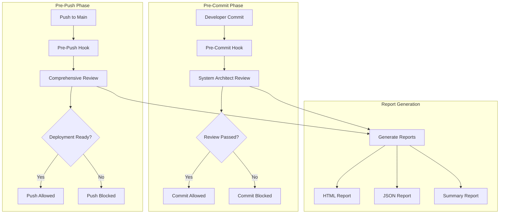

# 🔍 System Architect Code Review System

## 🎯 Overview
The System Architect Code Review System provides comprehensive automated code review for AWS deployment readiness. It ensures code quality, security, performance, and integration compatibility before commits and deployments.

## 🏗️ Architecture



## 🚀 Quick Start

### 1. Setup Pre-Commit Hooks
```bash
# Navigate to project root
cd SIMISAI

# Run setup script
chmod +x aws-deployment/code-review/setup-pre-commit.sh
./aws-deployment/code-review/setup-pre-commit.sh
```

### 2. Test the Review System
```bash
# Run manual review
./aws-deployment/code-review/system-architect-review.sh

# Run specific review category
./aws-deployment/code-review/system-architect-review.sh aws
./aws-deployment/code-review/system-architect-review.sh security
./aws-deployment/code-review/system-architect-review.sh performance
```

### 3. Generate Reports
```bash
# Generate reports from review output
python3 aws-deployment/code-review/generate-report.py

# Generate reports from file
python3 aws-deployment/code-review/generate-report.py --input review_output.txt
```

## 📋 Review Categories

### 1. **AWS Compatibility Review**
- ✅ Lambda function compatibility
- ✅ API Gateway integration
- ✅ Database connection configuration
- ✅ CloudFormation template validation
- ✅ Deployment script verification

### 2. **Security Review**
- ✅ Hardcoded secrets detection
- ✅ IAM policy configuration
- ✅ Security group setup
- ✅ VPC configuration
- ✅ CORS headers validation

### 3. **Performance Review**
- ✅ Lambda memory optimization
- ✅ Timeout configuration
- ✅ CloudFront caching
- ✅ Database connection pooling
- ✅ Error handling implementation

### 4. **Integration Review**
- ✅ SageMaker integration
- ✅ CV service integration
- ✅ Database integration
- ✅ Environment variables
- ✅ Fallback mechanisms

### 5. **Code Quality Review**
- ✅ Error logging implementation
- ✅ Info logging implementation
- ✅ Input validation
- ✅ HTTP status codes
- ✅ Code documentation

## 🔧 Configuration

### Review Configuration (`review-config.json`)
```json
{
  "review": {
    "enabled": true,
    "strict_mode": false,
    "auto_fix": false,
    "skip_patterns": [
      "*.md",
      "*.txt",
      "*.json",
      "*.yaml",
      "*.yml"
    ],
    "required_checks": [
      "aws_compatibility",
      "security",
      "performance",
      "integration"
    ],
    "optional_checks": [
      "code_quality",
      "documentation"
    ],
    "thresholds": {
      "min_success_rate": 80,
      "max_warnings": 5,
      "max_failures": 0
    }
  }
}
```

### Git Hooks Configuration
The system automatically sets up:
- **Pre-commit hook**: Runs review before every commit
- **Pre-push hook**: Runs comprehensive review before pushing to main
- **Commit-msg hook**: Validates conventional commit format

## 📊 Review Metrics

### Success Criteria
- **Minimum Success Rate**: 80%
- **Maximum Warnings**: 5
- **Maximum Failures**: 0
- **Required Checks**: All must pass
- **Optional Checks**: Recommended to pass

### Review Levels
1. **EXCELLENT** (90%+): Ready for deployment
2. **GOOD** (80-89%): Ready with minor fixes
3. **FAIR** (70-79%): Needs improvements
4. **POOR** (<70%): Significant work required

## 🚨 Common Issues & Solutions

### 1. **AWS Compatibility Issues**
```bash
# Issue: Missing AWS SDK
# Solution: Add to package.json
npm install @aws-sdk/client-sagemaker-runtime

# Issue: Incorrect Lambda runtime
# Solution: Update CloudFormation template
Runtime: nodejs18.x
```

### 2. **Security Issues**
```bash
# Issue: Hardcoded secrets
# Solution: Use environment variables
const password = process.env.DATABASE_PASSWORD;

# Issue: Missing IAM policies
# Solution: Add to CloudFormation template
Policies:
  - PolicyName: SageMakerAccess
    PolicyDocument: {...}
```

### 3. **Performance Issues**
```bash
# Issue: High Lambda timeout
# Solution: Optimize code and increase memory
MemorySize: 1024
Timeout: 60

# Issue: Missing caching
# Solution: Add CloudFront caching
DefaultCacheBehavior:
  Compress: true
  ForwardedValues:
    QueryString: false
```

### 4. **Integration Issues**
```bash
# Issue: Missing environment variables
# Solution: Add to Lambda configuration
Environment:
  Variables:
    SAGEMAKER_ENDPOINT: sealion-chat-endpoint
    CV_SERVICE_ENDPOINT: https://cv-service.example.com
```

## 📈 Report Generation

### HTML Report
- **Location**: `aws-deployment/code-review/reports/review_report_YYYYMMDD_HHMMSS.html`
- **Features**: Interactive dashboard, detailed check results, recommendations
- **Usage**: Open in browser for visual review

### JSON Report
- **Location**: `aws-deployment/code-review/reports/review_report_YYYYMMDD_HHMMSS.json`
- **Features**: Machine-readable format, API integration ready
- **Usage**: Programmatic analysis, CI/CD integration

### Summary Report
- **Location**: `aws-deployment/code-review/reports/review_summary_YYYYMMDD_HHMMSS.txt`
- **Features**: Quick overview, key metrics
- **Usage**: Quick status check, email notifications

## 🔄 Continuous Integration

### GitHub Actions Integration
```yaml
name: System Architect Review
on: [push, pull_request]

jobs:
  review:
    runs-on: ubuntu-latest
    steps:
      - uses: actions/checkout@v3
      - name: Run System Architect Review
        run: ./aws-deployment/code-review/system-architect-review.sh
      - name: Generate Reports
        run: python3 aws-deployment/code-review/generate-report.py
      - name: Upload Reports
        uses: actions/upload-artifact@v3
        with:
          name: review-reports
          path: aws-deployment/code-review/reports/
```

### Jenkins Integration
```groovy
pipeline {
    agent any
    stages {
        stage('Review') {
            steps {
                sh './aws-deployment/code-review/system-architect-review.sh'
            }
        }
        stage('Generate Reports') {
            steps {
                sh 'python3 aws-deployment/code-review/generate-report.py'
            }
        }
        stage('Archive Reports') {
            steps {
                archiveArtifacts 'aws-deployment/code-review/reports/*'
            }
        }
    }
}
```

## 🎯 Best Practices

### 1. **Commit Message Format**
Use conventional commits:
```
feat: add SageMaker integration
fix: resolve Lambda timeout issue
docs: update deployment guide
style: format code
refactor: optimize database queries
test: add integration tests
chore: update dependencies
```

### 2. **Review Workflow**
1. **Make changes** to code
2. **Run local review** before committing
3. **Fix issues** identified by review
4. **Commit with proper message**
5. **Push to feature branch**
6. **Create pull request**
7. **Review passes** automatically
8. **Merge to main**

### 3. **Error Handling**
- Always check review results before committing
- Fix high-priority issues immediately
- Address warnings when possible
- Use `--no-verify` only in emergencies

## 🚀 Advanced Usage

### Custom Review Rules
```bash
# Add custom checks to review script
# Edit aws-deployment/code-review/system-architect-review.sh

# Add new check function
check_custom_rule() {
    log_header "Custom Rule Review"
    # Your custom logic here
}
```

### Integration with IDE
```json
// VS Code tasks.json
{
    "version": "2.0.0",
    "tasks": [
        {
            "label": "System Architect Review",
            "type": "shell",
            "command": "./aws-deployment/code-review/system-architect-review.sh",
            "group": "build",
            "presentation": {
                "echo": true,
                "reveal": "always",
                "focus": false,
                "panel": "shared"
            }
        }
    ]
}
```

### Notification Integration
```bash
# Slack notification
curl -X POST -H 'Content-type: application/json' \
  --data '{"text":"System Architect Review: PASSED"}' \
  $SLACK_WEBHOOK_URL

# Email notification
echo "System Architect Review: PASSED" | mail -s "Review Status" team@company.com
```

## 📞 Support & Troubleshooting

### Common Problems
1. **Hooks not executing**: Check file permissions
2. **Review script not found**: Verify path and execution permissions
3. **Configuration errors**: Check JSON syntax in config file
4. **Report generation fails**: Ensure Python 3.6+ is installed

### Debug Mode
```bash
# Enable debug mode
export DEBUG=1
./aws-deployment/code-review/system-architect-review.sh

# Verbose output
./aws-deployment/code-review/system-architect-review.sh --verbose
```

### Contact Information
- **Technical Lead**: [Your Name] - [email]
- **DevOps Team**: [Team Email]
- **Documentation**: [Wiki/Confluence Link]

---

## 🎯 Next Steps

1. **Set up pre-commit hooks** for your team
2. **Configure review thresholds** based on your needs
3. **Integrate with CI/CD** pipeline
4. **Train team** on review process
5. **Monitor review metrics** and optimize

The System Architect Code Review System is now ready to ensure your AWS deployment quality! 🚀
